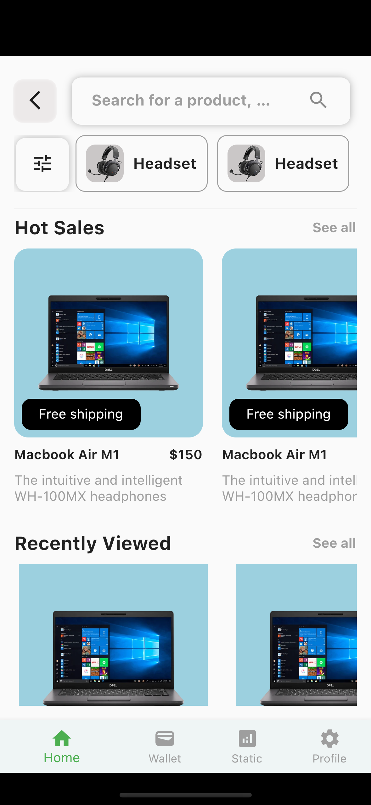
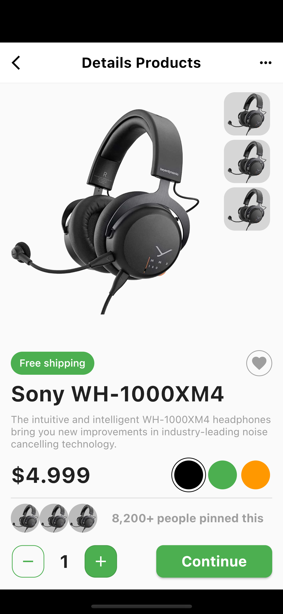
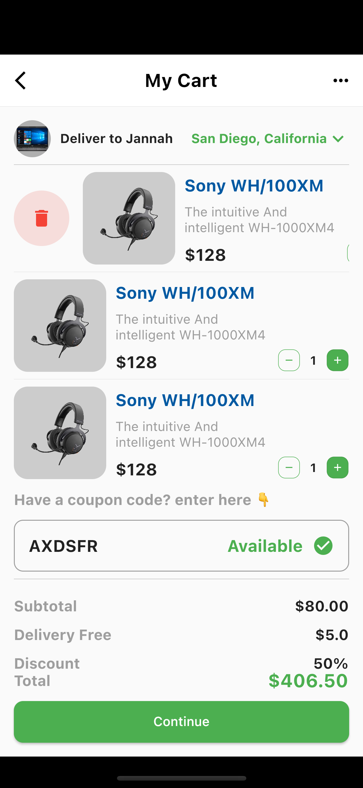
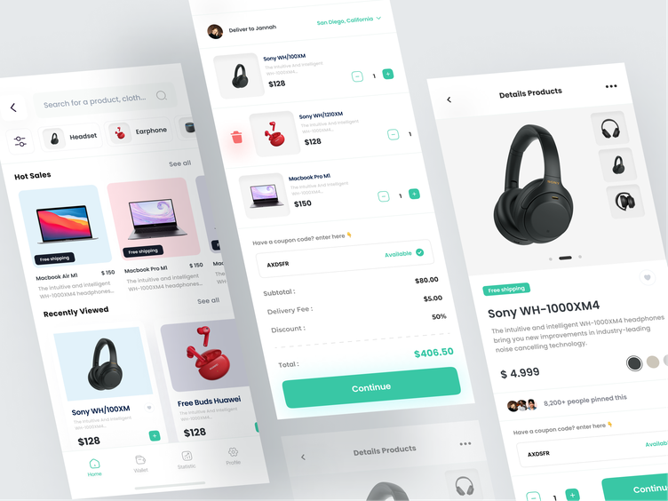
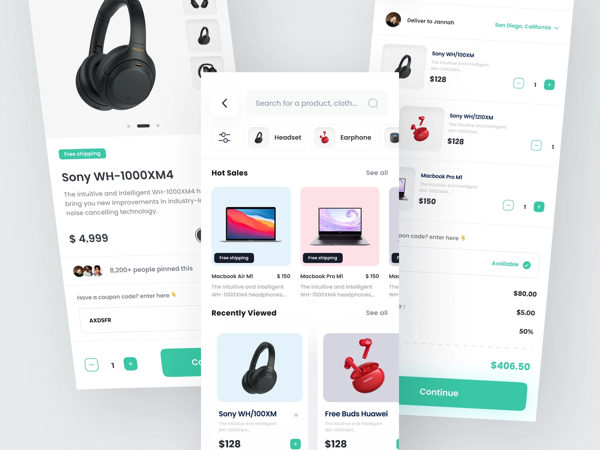
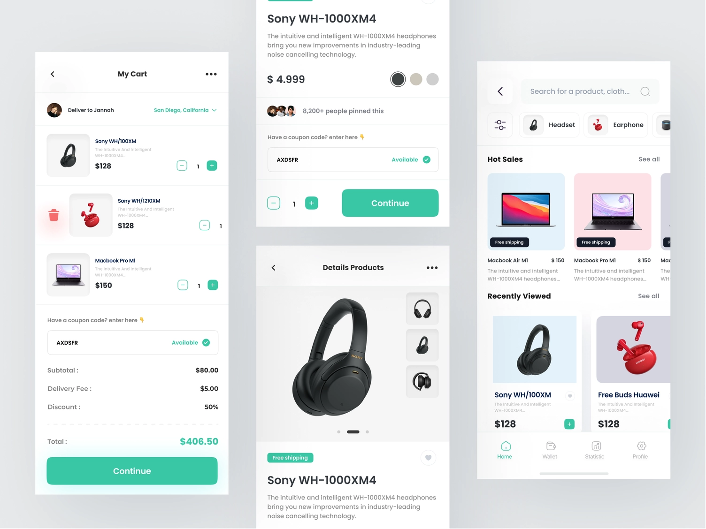
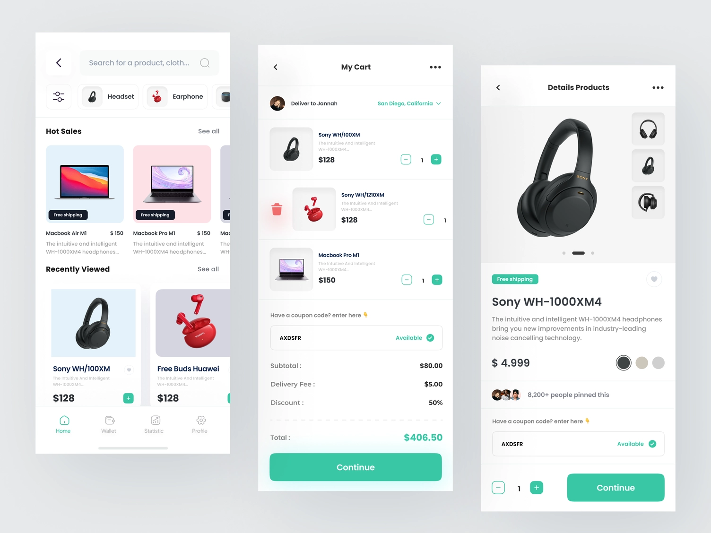

# Toko Megawa - Flutter UI Design
We implement code UI based on **TokoMegawa - E-Commerce** design by author **Habibi 🤖**.

**TokoMegawa - E - Commerce** of this concept is an e-commerce that sells various electronic equipmented. inspired by *Risang Kuncoro*

We made the interface design using flutter code. Here are some images after implementation:

- Home screen

- Details product screen

- My cart screen

## Contact Information
Author: **Tăng Minh Tín**

Youtube: [Tăng Minh Tín](https://www.youtube.com/c/T%C4%83ngMinhT%C3%ADn)

Facebook: [Tăng Minh Tín](https://www.facebook.com/tangminhtin)

Email: minhtintang@gmail.com

## References
Available link on Dribbble: [TokoMegawa - E-Commerce](https://dribbble.com/shots/18733610-TokoMegawa-E-Commerce)

### Basic UI Design
- Image 1

- Image 2

- Image 3

- Image 4

